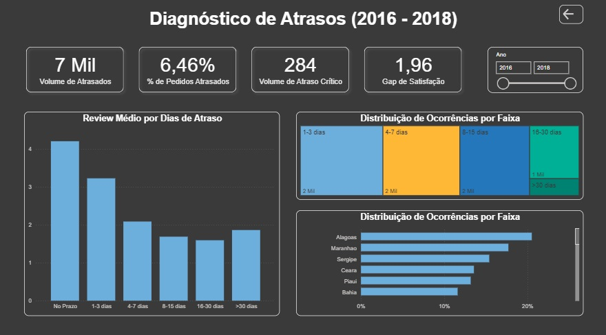

# Olist Logistics: Performance & Satisfação do Cliente

## 📋 Visão Geral do Projeto

Este projeto consiste em uma análise end-to-end de mais de **109.000 registros** de vendas da Olist. O foco principal foi investigar como a eficiência logística impacta diretamente a percepção do cliente, utilizando **Python** para o tratamento de dados e **Power BI** para a construção de um dashboard estratégico e diagnóstico.

---

## 🔍 Descobertas Estratégicas (Insights)

A análise revelou padrões críticos que fundamentam decisões de negócio:

* **📏 A Regra dos 3 Dias:** Identifica-se que o "ponto de ruptura" da satisfação ocorre após o 3º dia de atraso. A partir desse marco, a nota média (`review_score`) sofre uma queda brusca, transformando clientes neutros em detratores.
* **🧠 O Paradoxo do Alívio:** Através do processamento em Python, detecta-se que em atrasos extremos (>30 dias), a nota apresenta uma leve subida em relação à faixa anterior. Isso sugere um alívio psicológico do consumidor ao receber um produto que já considerava perdido.
* **📍 Gargalos Regionais:** Enquanto o **OTIF (Entrega no Prazo) global é de 93,54%**, estados como **Alagoas (20,52% de atraso)** e **Maranhão (17,71%)** apresentam gargalos severos que exigem revisão da malha logística no Nordeste.

---

## 🛠️ Tecnologias Utilizadas

* **Python:** Limpeza de dados (Data Cleaning), tratamento de nulos, agrupamento por faixas (`pd.cut`) e análise exploratória.
* **Power BI:** Modelagem de dados, criação de indicadores (KPIs) e design de interface (UI/UX).
* **DAX (Data Analysis Expressions):** Desenvolvimento de métricas avançadas como Gap de Satisfação e Taxa de Inadimplência Logística.

---

## 📊 Estrutura do Dashboard

O dashboard foi projetado em duas camadas para facilitar a navegação e o entendimento:

### 1. Visão Geral (Nível Executivo)
Focada em monitorar a saúde da operação:
* Volume de vendas e faturamento total.
* Taxa de OTIF (On-Time In-Full).
* Distribuição geográfica de pedidos.

### 2. Diagnóstico Logístico (Nível Tático)
Focada em entender as causas raízes:
* Correlação entre dias de atraso e satisfação do cliente.
* Ranking de atrasos por estado (UF).
* Identificação do **Gap de Satisfação (1,96 pontos)** entre pedidos no prazo vs. atrasados.

---

## 🧪 Desafios Técnicos & Soluções

A execução deste projeto exigiu a superação de obstáculos técnicos tanto na modelagem quanto na visualização:

* **Geolocalização e Ambiguidade:** Durante a criação do mapa, o Power BI apresentou dificuldades para identificar corretamente os estados brasileiros apenas pelas siglas (ex: "AL" sendo interpretado fora do contexto nacional). 
    * **Solução:** Foi realizada uma etapa de tratamento de dados para criar uma coluna de "Localização Completa", concatenando o nome do estado com o país ("Estado, Brasil"), além da correta categorização dos dados geográficos no Power BI, garantindo 100% de precisão no mapa.
* **Consistência de Dados (Python vs. Power BI):** O volume de atrasos críticos inicialmente divergia entre as ferramentas. 
    * **Solução:** Realizei uma auditoria técnica utilizando filtros de qualidade rigorosos (exclusão de registros sem nota, status diferente de "delivered" e limite de 90 dias de atraso), alinhando o dashboard à análise estatística feita em Python, chegando ao número fiel de **284 pedidos críticos**.

---

## 🤝 Conecte-se comigo
* **LinkedIn:** [https://www.linkedin.com/in/domingos-ferreira-alves-579368132]
* **Portfólio:** [https://dfadomingos.github.io/portfolio]